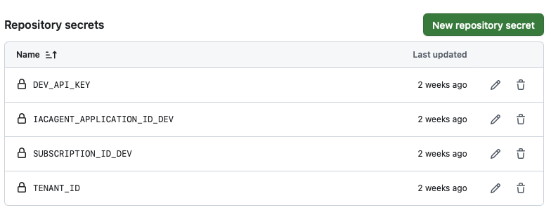
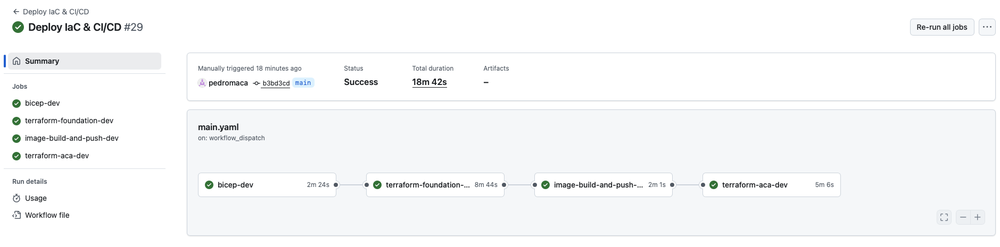
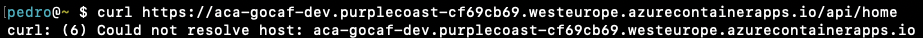
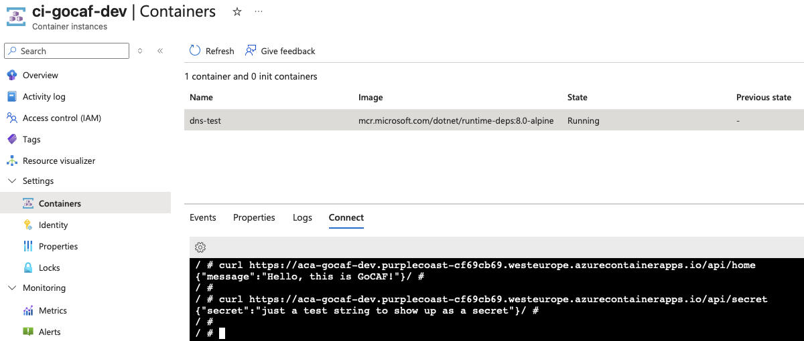

# Why GoCAF



## Azure Services

GoCAF (Go Containerized Azure Function) is a custom handler Azure Function deployed through the Azure Container Apps service.

Typically, the Azure Functions service natively supports a few different languages/frameworks namely dotnet, python, node, powershell and, as is the case, custom. The service also supports containers, but that is enabled through the licensing options and not the service "runtime" itself.

However, there is now support for Azure Functions to be deployed through the Azure Container Apps service. While it might be confusing at first, you are effectively deploying an Azure Container App which is explicitely optimized for Functions and not a native Azure Function which has been containerized. Refer to [Azure Functions on Azure Container Apps overview](https://learn.microsoft.com/en-us/azure/container-apps/functions-overview) for further details.

## Application

In the case of GoCAF, the application is built in Go ([Gin-Gonic]( https://gin-gonic.com/)) and containerized through a Dockerfile. The docker image is pushed onto an Azure Container Registry from which the Azure Container Apps Environment pulls the image and finally serves it through the Azure Container App.

> For the purposes of this example, the application server is as basic as it can be

```go {linenos=true}
   package main

   import (
      "log"
      "net/http"
      "os"

      "github.com/gin-gonic/gin"
   )

   func main() {
      log.SetOutput(os.Stdout) // ensures Azure treats logs as info
      router := gin.Default()
      router.GET("/", sayRoot)
      router.GET("api/home", sayHello)
      router.GET("api/secret", secret)

      port_info := APIPort()
      router.Run(port_info)
      log.Println("API is up & running - " + port_info)
   }

   func APIPort() string {
      port := ":8080"
      if val, ok := os.LookupEnv("FUNCTIONS_CUSTOMHANDLER_PORT"); ok {
         port = ":" + val
      }
      return port
   }

   // sayRoot logs that the server is running (useful for monitoring on Azure)
   func sayRoot(c *gin.Context) {
      log.Println("Invoke Root\n\tthis output means azure function custom handler (gin go) is running")
   }

   // sayHello outputs a Hello message
   func sayHello(c *gin.Context) {
      log.Println("Invoke Home")
      c.JSON(http.StatusOK, gin.H{
         "message": "Hello, this is GoCAF!",
      })
   }

   // secret helps verifying the server can capture env variables
   func secret(c *gin.Context) {
      log.Println("Invoke Secret")
      apiKey := os.Getenv("GOCAF_TOKEN")
      c.JSON(http.StatusOK, gin.H{
         "secret": apiKey,
      })
   }
```

The Azure Functions part follows the convention and both endpoints/functions are HttpTrigger(ed)

```tree
   gocaf/
   ├── api (built app binary)
   ├── home
   │   ├── function.json
   ├── secret
   │   ├── function.json
   ├── host.json
   ├── (other files/directories)
```

The application layer in GoCAF can be summarized into the diagram below:


> The Dockerfile uses `mcr.microsoft.com/azure-functions/base:4` which is the [recommended image for customer handler Functions](https://learn.microsoft.com/en-us/azure/azure-functions/container-concepts?utm_source=chatgpt.com#maintaining-custom-containers).

```docker {linenos=true}
   # Build stage - only used for building the Go binary
   FROM golang:1.25.0-alpine AS builder

   # Set working directory for build
   WORKDIR /build

   # Copy go mod files first for better layer caching
   COPY go.mod go.sum ./

   # Download dependencies
   RUN go mod download

   # Copy the source code
   COPY cmd/ ./cmd/

   # Build the Go application for Linux x86_64 (important for Azure)
   RUN CGO_ENABLED=0 GOOS=linux GOARCH=amd64 go build -o api ./cmd/api.go

   # Runtime stage - the actual Azure Functions container
   FROM mcr.microsoft.com/azure-functions/base:4

   # Set environment variables
   ENV AzureWebJobsScriptRoot=/home/site/wwwroot \
      AzureFunctionsJobHost__Logging__Console__IsEnabled=true \
      FUNCTIONS_WORKER_RUNTIME=custom \
      FUNCTIONS_CUSTOMHANDLER_PORT=8080

   # Create working directory
   WORKDIR /home/site/wwwroot

   # Copy only the compiled binary from the builder stage
   COPY --from=builder /build/api ./api

   # Copy Azure Functions configuration files
   COPY host.json ./
   COPY home ./home/
   COPY secret ./secret/

   # Make the binary executable
   RUN chmod +x api

   # Expose the port that Azure Functions will use
   EXPOSE 8080

   # The Azure Functions host will start and call our custom handler
   CMD ["/azure-functions-host/Microsoft.Azure.WebJobs.Script.WebHost"]
```

## Additional Infrastructure

### Azure Key Vault

GoCAF has been conceived with the storage of secrets in mind done through the usage of Azure Key Vault. The application leverages secrets such as API Keys which are securely stored in an Azure Key Vault.

### Networking Architecture

The infrastructure implements a **private networking model** designed for internal API consumption. A dedicated VNet contains a delegated subnet for Azure Container Apps with a self-managed internal load balancer, ensuring the API is only accessible within the Azure network boundary. The Container App Environment is configured with `internal_load_balancer_enabled = true`, creating internal-only endpoints that make it accessible to others (like an Azure Container Instance) in the same VNet. Other teams can also access it via VNet peering. A Network Security Group restricts inbound traffic to HTTPS from the VNet address space, while a private DNS zone enables service discovery. Dependencies like Key Vault use Azure's "trusted services bypass" feature, eliminating the need for private endpoints while maintaining security.

**Note**: When the Container App Environment is deployed with `internal_load_balancer_enabled = true`, Azure automatically creates additional managed infrastructure in a separate resource group. This managed resource group contains the internal load balancer which is fully managed by Azure.

#### VNet Peering Requirements

For other teams to consume this API, VNet peering must be established between their networks and this infrastructure's VNet. The Container App's internal load balancer only accepts traffic from within the VNet boundary.

### Azure Container Instance

A basic Azure Container Instance, with `curl` capabilities, is deployed to demonstrate that the Containerized App is indeed reachable when the request comes from within the same VNet.

## Cherry on top

This is a 100% secretless/passwordless workflow relying on federated credentials for pipeline runs and system assigned managed identities to satisfy RBAC needs throughout the whole process.

# Pre-requisites

There aren't many pre-requisites for GoCAF but rather a few elements which have to be in place before deployment.

## Identities & RBAC

GoCAF makes use of an **IaC Agent** which is responsible for the deployment of the resources onto the target Azure Subscription. This agent is also responsible for pushing the secrets onto the Key Vault and pushing the application image onto the Container Registry (both of these permissions are terraformed). 

As such, the following is required for the agent to work:
  - A federated credential allows the agent to be used in GitHub Actions and authenticate to Azure.
  - The agent must be a `Contributor` on the target Azure Subscription.
  - The agent must be a `User Access Administrator` on the target Azure Subscription.

## Azure Resource Group

As GoCAF leverages Terraform and its state management capabilities, a Resource Group must exist in the target Azure Subscription so that a bicep job can deploy the storage account for Terraform.

## GitHub Repository Actions Secrets

The workflow leverages some repository secrets to essentially identify and authenticate the service principal running the pipeline. 



The `DEV_API_KEY` secret is the environment variable used in the `api/secret` endpoint.

# Infrastructure & Infrastructure as Code (IaC)


The terraformed infrastructure is deployed in 2 parts due to the fact that the Azure Container Apps (ACA) instance cannot point to the Registry image without it being there in the first place. As such, all the infrastructure is deployed EXCEPT the ACA, then the image is built and pushed to the Azure Container Registry, and only finally the ACA is deployed.



> For the purposes of testing that the function is running and accessible within the Vnet a Container Instance, deployed onto its own subnet, can be used to run `curl <app-fqdn>/api/home`

## Tree view of IaC

The directories and files of IaC look like the following

```
iac/
├── bicep
│   ├── main.bicep
│   ├── modules
│   │   └── storage_role_assignment.bicep
│   └── parameters
│       └── dev.bicepparam
└── terraform
    ├── aca
    │   ├── backend.tfvars
    │   ├── dev.tfvars
    │   ├── main.tf
    │   ├── modules
    │   │   ├── aca
    │   │   │   ├── aca.tf
    │   │   │   ├── outputs.tf
    │   │   │   └── variables.tf
    │   │   └── keyvault
    │   │       ├── keyvault.tf
    │   │       ├── outputs.tf
    │   │       └── variables.tf
    │   └── variables.tf
    └── foundation
        ├── backend.tfvars
        ├── dev.tfvars
        ├── main.tf
        ├── modules
        │   ├── acr
        │   │   ├── acr.tf
        │   │   ├── outputs.tf
        │   │   └── variables.tf
        │   ├── cae
        │   │   ├── cae.tf
        │   │   ├── outputs.tf
        │   │   └── variables.tf
        │   └── networking
        │       ├── networking.tf
        │       ├── outputs.tf
        │       └── variables.tf
        ├── outputs.tf
        └── variables.tf
```

## Deployment Stages

The deployment of the infrastructure follows a multi-stage deployment approach.

1. **Bicep Foundation**
   - Get the IaCAgent ObjectId
   - Deploy storage account to host Terraform state
   - Assign `Storage Blob Data Contributor` role to the IaCAgent

2. **Terraform Foundation**
   - Deploy Networking setup
     - Network Security Group
     - Virtual Network & Subnets
     - Private DNS Zone + Network link
   - Deploy Azure Container Registry (ACR)
   - Deploy Azure Container App Environment (CAE) with managed identity
   - Deploy Log Analytics Workspace
   - Assign role permissions (CAE managed identity to ACR)

3. **Image Build & Push**
   - Build Docker image
   - Push image to Azure Container Registry (ACR)

4. **Terraform ACA Deployment**
   - Deploy Azure Key Vault (KV)
   - Deploy Azure Container App (ACA) with managed identity
   - Deploy Azure Storage Account (for blob triggered function)
   - Additional Networking Setup
      - Private DNS A Record to allow service discovery
   - Configure role assignments and permissions
   - Deploy Azure Container Instance (within the same VNet as ACA)

## Deployment Pipeline

The deployment workflow is available at `.github/workflows/main.yaml` which, as previously highlighted, follows a multi-stage deployment approach.

The first time the resources are deployed it might take the pipeline around ~20min to run until the end.



# Wrapping up

After the pipeline runs successfully, the resources are all in place and 3 relevant questions are to be answered:
1. Can the API be reached from the internet?
2. Can the API be reached from the VNet?
3. Has the secret been loaded successfully onto the API?

We can learn the Container App URL (fqdn) by going to the resource itself and copying it.

## Trying to reach the API from the internet

Opening a terminal and `curl <app-fqdn>/api/home` or `/api/secret` will output a DNS resolution failure



## Trying to reach the API from the VNet

Using the Azure Container Instance and `curl <app-fqdn>/api/home` will output the welcome message and `curl <app-fqdn>/api/secret` will output the secret.



# Notes

Common pitfalls:
- RBAC `Contributor` and/or `User Access Administrator` have not been granted to the service principal on the Subscription level.
- When setting up VNet Peering the address prefixes overlap.

Limitations:
- `terraform destroy` won't work because of the multiple interdependencies between the different resources (e.g.: container app environment cannot be deleted before the container app itself).
- If the Key Vault is configured with "soft delete" enabled for the secrets, this will result in subsequent pipeline runs to fail because the secret is still there.
